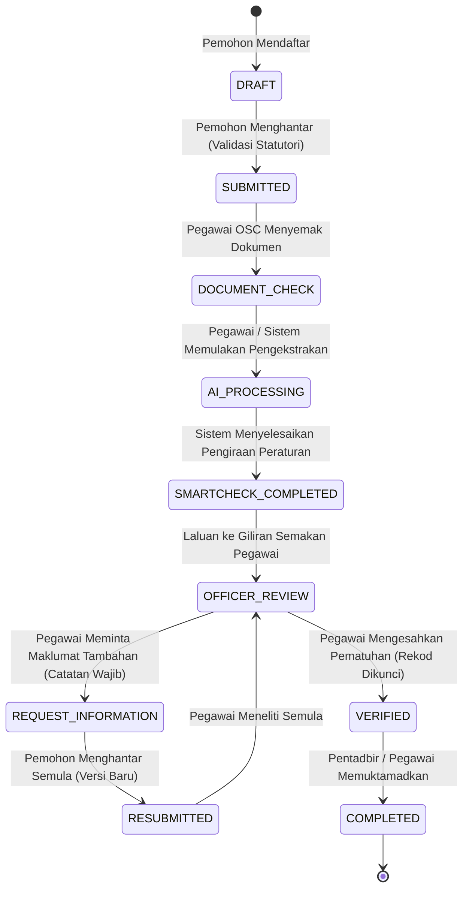

# OSC SmartCheck AI — Application Workflow State Machine

**Project:** OSC SmartCheck AI  
**Organization:** One Stop Centre (OSC), Majlis Perbandaran Langkawi Bandaraya Pelancongan (MPLBP)

---

## 1. Architectural Overview & State Machine Flow

The planning application compliance workflow under MPLBP is governed by a strict, finite state machine where status transitions can only be triggered through validated server-side workflows. Browser clients are completely prevented from mutating application lifecycle states directly.



---

## 2. Transition Matrix & Role-Based Authorization

| Source Status | Target Status | Permitted Actors | Pre-Condition & Operational Constraints |
|---|---|---|---|
| `DRAFT` | `SUBMITTED` | `APPLICANT`, `SUPER_ADMIN` | Caller must own application. Validates required planning fields (`title`, `developmentType`, `district`, `state`, `applicantUid`, and `lotNo` OR coordinates). Generates collision-safe application number `KM/YYYY/XXXXXX` and sets server timestamp `submittedAt`. |
| `SUBMITTED` | `DOCUMENT_CHECK` | `OSC_OFFICER`, `SUPER_ADMIN` | OSC technical staff initiates document completeness checking. |
| `DOCUMENT_CHECK` | `AI_PROCESSING` | `OSC_OFFICER`, `SYSTEM`, `SUPER_ADMIN` | Triggers Document AI extraction pipeline and schedule parsing. |
| `AI_PROCESSING` | `SMARTCHECK_COMPLETED` | `SYSTEM`, `SUPER_ADMIN` | Strictly executed by serverless microservices / deterministic rule engine. Normal users/officers cannot trigger directly. |
| `SMARTCHECK_COMPLETED`| `OFFICER_REVIEW` | `OSC_OFFICER`, `SYSTEM`, `SUPER_ADMIN` | Routes compliance calculations into the human-in-the-loop (HITL) officer review queue. |
| `OFFICER_REVIEW` | `REQUEST_INFORMATION` | `OSC_OFFICER`, `PLANNING_OFFICER`, `SUPER_ADMIN` | Mandatory requirement: non-empty `remarks` explaining missing statutory parameters or drawing amendments. |
| `REQUEST_INFORMATION` | `RESUBMITTED` | `APPLICANT`, `SUPER_ADMIN` | Caller must own application. Increments `currentVersion`, preserves previous document records, and registers new version snapshot under `versions/v{N}`. |
| `RESUBMITTED` | `OFFICER_REVIEW` | `OSC_OFFICER`, `SUPER_ADMIN` | Returned to technical officer for re-evaluation. |
| `OFFICER_REVIEW` | `VERIFIED` | `OSC_OFFICER`, `SUPER_ADMIN` | Officer applies formal statutory endorsement. Creates immutable verification snapshot and sets server timestamp `verifiedAt`. |
| `VERIFIED` | `COMPLETED` | `OSC_OFFICER`, `ADMIN`, `SUPER_ADMIN` | Final administrative clearance presented to OSC Committee. |

---

## 3. Mandatory Statutory Validation Rules

### 3.1. Prerequisites for `DRAFT -> SUBMITTED`
An application cannot transition to `SUBMITTED` unless:
1. `title`: Defined with minimum 5 characters.
2. `developmentType`: Must match one of `HOUSING`, `HOTEL`, `COMMERCIAL`, `INDUSTRIAL`, `MIXED_DEVELOPMENT`, `OTHER`.
3. `district` & `state`: Populated (defaults: `'Langkawi'`, `'Kedah'`).
4. `applicantUid`: Validated against authenticated caller context.
5. Spatial Anchor: Must have at least a valid `lotNo` OR valid geographic coordinates (`latitude` and `longitude`).

### 3.2. Remarks Requirement for `REQUEST_INFORMATION`
Officers issuing a clarification or query to applicants must supply actionable, itemized statutory remarks. Empty remarks are rejected with `VALIDATION_FAILED`.

---

## 4. Atomic Execution & Audit Behavior

Every state transition executes inside an isolated Firestore `runTransaction()` block:

1. **Transactional Read:** Validates current status and locking flags.
2. **Application Update:** Modifies `status`, `updatedAt`, `updatedBy`, `submittedAt` / `verifiedAt`.
3. **Status History Entry:** Atomically writes to subcollection `applications/{id}/statusHistory/{historyId}`:
   ```json
   {
     "fromStatus": "DRAFT",
     "toStatus": "SUBMITTED",
     "action": "TRANSITION_SUBMITTED",
     "actorUid": "applicant-uid",
     "actorRole": "APPLICANT",
     "timestamp": "SERVER_TIMESTAMP",
     "remarks": null
   }
   ```
4. **Immutable Audit Record:** Atomically writes to top-level `auditLogs/{auditId}` collection:
   ```json
   {
     "eventType": "APPLICATION_STATUS_TRANSITION",
     "resourceType": "applications",
     "resourceId": "application-id",
     "applicationId": "application-id",
     "actorUid": "applicant-uid",
     "actorRole": "APPLICANT",
     "timestamp": "SERVER_TIMESTAMP",
     "metadata": {
       "fromStatus": "DRAFT",
       "toStatus": "SUBMITTED",
       "applicationNo": "KM/2026/A8F93B",
       "versionNumber": 1
     }
   }
   ```
5. **Zero Partial Writes:** If any operation or constraint fails, the transaction is completely aborted.

---

## 5. Standardized Error Handling

| Error Code | HTTP Status | Description |
|---|---|---|
| `UNAUTHENTICATED` | 401 | Missing, expired, or invalid Firebase ID token. |
| `PERMISSION_DENIED` | 403 | Caller role is not permitted for the requested transition, or ownership violation. |
| `APPLICATION_NOT_FOUND` | 404 | Application document does not exist in Firestore. |
| `INVALID_TRANSITION` | 400 | The requested transition does not exist in the state machine matrix. |
| `VALIDATION_FAILED` | 400 | Required fields (e.g. coordinates/lotNo, non-empty remarks) are missing. |
| `APPLICATION_LOCKED` | 409 | Application is locked or finalized in an immutable verified state. |
| `CONFLICT` | 409 | Concurrent transaction collision or stale state conflict. |

---

## 6. Localized Government UI Labels

| Technical Status Enum | Official Malay UI Label | Visual Variant |
|---|---|---|
| `DRAFT` | **Draf** | Neutral (Slate) |
| `SUBMITTED` | **Dihantar** | Info (Sky) |
| `DOCUMENT_CHECK` | **Semakan Dokumen** | Info (Blue) |
| `AI_PROCESSING` | **Pemprosesan AI** | Gold / Indigo |
| `SMARTCHECK_COMPLETED` | **SmartCheck Selesai** | Info (Cyan) |
| `OFFICER_REVIEW` | **Semakan Pegawai** | Warning (Amber) |
| `REQUEST_INFORMATION` | **Maklumat Tambahan Diperlukan** | Danger (Rose) |
| `RESUBMITTED` | **Dihantar Semula** | Info (Cyan) |
| `VERIFIED` | **Disahkan** | Success (Emerald) |
| `COMPLETED` | **Selesai** | Success (Green) |
