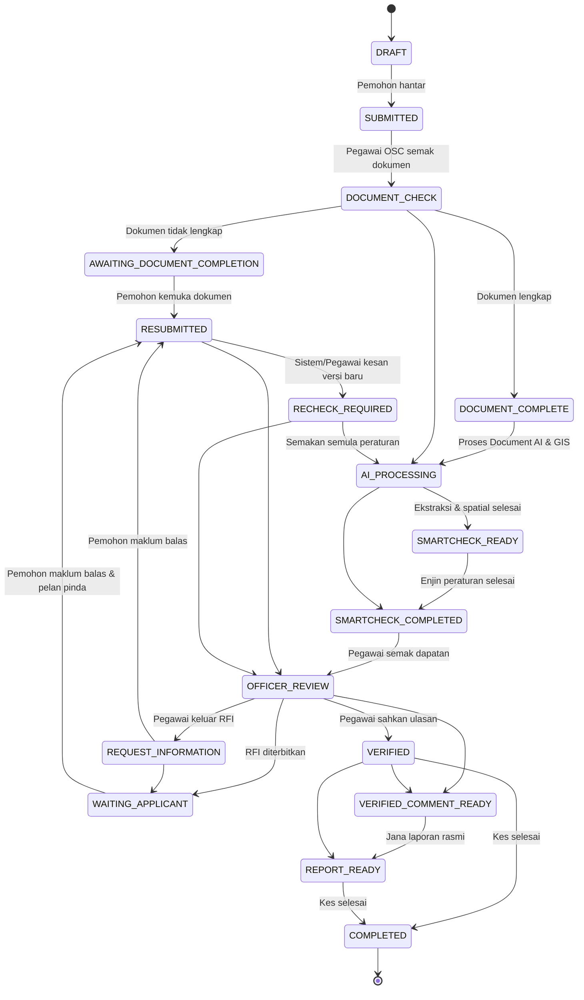

# End-to-End Workflow Lifecycle — OSC SmartCheck AI
**Majlis Perbandaran Langkawi Bandaraya Pelancongan (MPLBP)**

## 1. Statutory Scope & Governance Principles
The OSC SmartCheck AI end-to-end lifecycle manages the technical pre-check, document verification, Request for Information (RFI), resubmission impact, and final reporting of Kebenaran Merancang (KM) planning applications.

> [!IMPORTANT]
> **Statutory Notice:** Completion of the OSC SmartCheck AI pre-checking workflow (`COMPLETED`) signifies that all automated rules, officer verifications, and compliance matrices have been finalized. It does **NOT** constitute statutory approval of Kebenaran Merancang (KM) under Akta Perancangan Bandar dan Desa 1976 (Akta 172). Formal statutory KM decisions remain exclusively within the purview of the OSC Committee Meeting (Mesyuarat Jawatankuasa OSC).

## 2. State Transition Lifecycle Matrix

## 3. Transition Auditing & Immutability
All status changes are recorded in two immutable subcollections:
1. `applications/{applicationId}/statusHistory/{historyId}`: Simple status timeline.
2. `applications/{applicationId}/workflowHistory/{transitionId}`: Detailed operational transition audit with actor role, reason, related documents, and automatic/manual flag.
